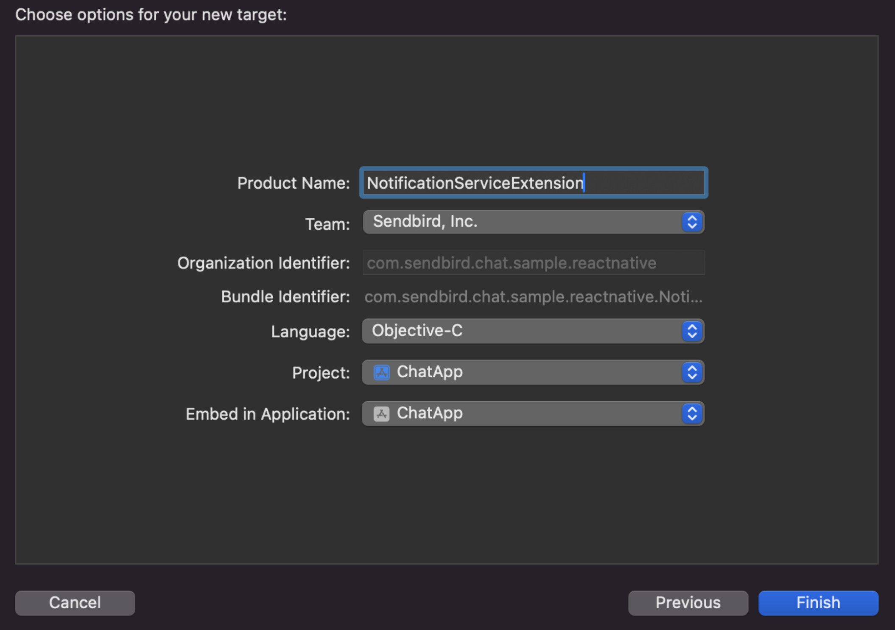

# @sendbird/react-native-push-extension

Sendbird Push Notifications extension for React-Native

## Installation

```sh
yarn add @sendbird/react-native-push-extension
```

## Implementation

Use iOS's [App Groups](https://developer.apple.com/documentation/xcode/configuring-app-groups) for device token tracking and analysis of Sendbird push notifications.
Update the `AppDelegate.h` and `AppDelegate.mm` files to implement UserNotificationCenterDelegate and configure NotificationServiceExtension.

### Modify the AppDelegate.h

```objc
// AppDelegate.h
#import <UserNotifications/UNUserNotificationCenter.h>

@interface AppDelegate : RCTAppDelegate<UNUserNotificationCenterDelegate>
```

### Modify the AppDelegate.mm

```objc
// AppDelegate.mm

#import "SendbirdNotificationHelper.h"

- (BOOL)application:(UIApplication *)application didFinishLaunchingWithOptions:(NSDictionary *)launchOptions
{
  // ...

  // SendbirdPushExtension: set app group
  [SendbirdNotificationHelper setAppGroup:@"your.app.group.name"]; // Set your App Groups name here

  // ...
}

- (void)application:(UIApplication *)application didRegisterForRemoteNotificationsWithDeviceToken:(NSData *)deviceToken
{
  // SendbirdPushExtension: register device token
  [SendbirdNotificationHelper didRegisterForRemoteNotificationsWithDeviceToken:deviceToken];
}
```

### Configuring NotificationServiceExtension

> Note: This step is optional If your app is already using NotificationServiceExtension.

- In the XCode top menu, click **[File > New > Target > Notification Service Extension]** to create it.
  

- To link the extension, update the Podfile.

```ruby
target 'NotificationServiceExtension' do
  // The below use_frameworks part may differ by project, so handle it according to your project's Podfile settings.
  // use_frameworks! :linkage => :static

  pod 'sendbird-notifications-extension', :path => '../node_modules/@sendbird/react-native-push-extension'
end
```

- After making the modifications, connect the module to your project with the `npx pod-install` command. Then modify the `NotificationService` file in the NotificationServiceExtension created in XCode.

#### objc

```objc
// NotificationService.m

#import "SendbirdNotificationHelper.h"

@implementation NotificationService
- (void)didReceiveNotificationRequest:(UNNotificationRequest *)request withContentHandler:(void (^)(UNNotificationContent * _Nonnull))contentHandler {
  // ...

  // SendbirdPushExtension: set app group
  [SendbirdNotificationHelper setAppGroup:@"your.app.group.name"]; // Set your App Groups name here


  // SendbirdPushExtension: call markPushNotificationAsDelivered()
  [SendbirdNotificationHelper markPushNotificationAsDelivered:self.bestAttemptContent.userInfo completionHandler:nil];

  // ...
}
```

#### swift

```swift
// NotificationService.swift

import sendbird_notifications_extension

override func didReceive(_ request: UNNotificationRequest, withContentHandler contentHandler: @escaping (UNNotificationContent) -> Void) {
  // ...

  // SendbirdPushExtension: set app group
  SendbirdNotificationHelper.setAppGroup("your.app.group.name")

  // SendbirdPushExtension: call markPushNotificationAsDelivered()
  SendbirdNotificationHelper.markPushNotification(asDelivered: bestAttemptContent.userInfo)

  // ...
}
```

### Handling foreground push notifications

iOS typically receives push notifications while the app is in the background.
However, notifications can also be delivered when the app is active and in the foreground.
If a notification arrives without displaying a banner, it may still be marked as `DELIVERED` by the Sendbird system.
Implement the `willPresentNotification` method to ensure notifications are presented to the user during these cases.

```objc
- (void)userNotificationCenter:(UNUserNotificationCenter *)center
       willPresentNotification:(UNNotification *)notification
         withCompletionHandler:(void (^)(UNNotificationPresentationOptions))completionHandler
{
  if (notification.request.content.userInfo[@"sendbird"] != nil) {
    completionHandler(UNNotificationPresentationOptionAlert);
  }
}
```

## Troubleshooting

If you encounter a build error indicating a conflict with Firebase (e.g., `[CP-User][RNFB] ~~`), adjust the placement of the Embed Frameworks extension in the project's Build Phases.

## License

MIT

---

Made with [create-react-native-library](https://github.com/callstack/react-native-builder-bob)
